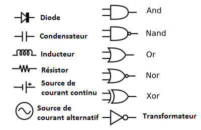
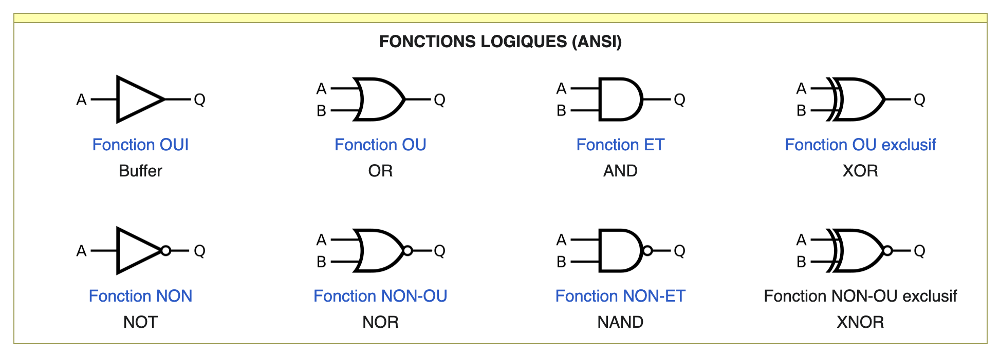

# Définition schéma électrique
Un schéma électrique est une représentation graphique d'un circuit électrique, basée sur des conventions.

Il traduit, sous forme de symboles normalisés, les composants du circuit ainsi que l'alimentation et les signaux reliant ces composants. La position graphique des composants et de leurs interconnexions ne reflète pas toujours le positionnement physique de ceux-ci, contrairement aux positions qui figurent sur un schéma-bloc ou sur un schéma de câblage.

Un schéma électrique d'un projet technique est utilisé pour la conception, la fabrication (cas d'un circuit imprimé) et la maintenance des systèmes électriques et électroniques.



# Les symboles normalisés
## Circuits intégrés
### FONCTIONS LOGIQUES (ANSI)

1. Buffer (Fonction OUI)
La fonction OUI est un opérateur logique de l'algèbre de Boole. À un opérande, qui peut avoir la valeur VRAI ou FAUX, il associe un résultat qui a la même valeur que celle de l'opérande.
```bash
    Table de vérité OUI
----------------------------
    Entrée  |	Sortie
----------------------------
    a	    |    L
    0	    |    0
    1	    |    1
```

2. OR (Fonction OU)
La fonction OU ou OU inclusif est un opérateur logique de l'algèbre de Boole. À deux opérandes, qui peuvent avoir chacun la valeur VRAI ou FAUX, il associe un résultat qui a lui-même la valeur VRAI seulement si au moins un des deux opérandes a la valeur VRAI.
```bash
    Table de vérité OU (OR)
----------------------------
    Entrées |	Sortie
----------------------------
    a |	b	|    L
    0 |	0	|    0
    0 |	1	|    1
    1 |	0	|    1
    1 |	1	|    1
```

3. AND (Fonction ET)
La fonction ET est un opérateur logique de l'algèbre de Boole. À deux opérandes, qui peuvent avoir chacun la valeur VRAI ou FAUX, il associe un résultat de sortie qui a lui-même la valeur VRAI seulement si les deux opérandes ont la valeur VRAI.
```bash
            Table de vérité
-------------------------------------------
    Opérande 1 |	Opérande 2 |	Résultat
-------------------------------------------
    a	       |    b	       |    a ET b
    0	       |    0	       |    0
    0	       |    1	       |    0
    1	       |    0	       |    0
    1	       |    1	       |    1
    VRAI	   |    FAUX	   |    FAUX
```

4. XOR (Fonction OU exclusif)
La fonction OU exclusif, souvent appelée XOR (eXclusive OR) ou disjonction exclusive, ou somme binaire en cryptographie où il est noté +, ou encore ⊻ en algèbre relationnelle, est un opérateur logique de l'algèbre de Boole à deux opérandes, qui peuvent avoir chacun la valeur VRAI ou FAUX. Il associe un résultat qui a lui-même la valeur VRAI seulement si les deux opérandes ont des valeurs distinctes.
Cet opérateur est très utilisé en électronique, en informatique, et aussi en cryptographie du fait de ses propriétés intéressantes.

```bash
    Table de vérité de XOR
-------------------------------
    A	|   B	|   R = A ⊕ B
-------------------------------
    0	|   0	|   0
    0	|   1	|   1
    1	|   0	|   1
    1	|   1	|   0
```

5. NOT (Fonction NON)
La fonction NON (NOT en anglais) est un opérateur logique de l'algèbre de Boole et exprime un « état » en fonction de conditions. À un opérande, qui peut avoir la valeur VRAI ou FAUX, il associe un résultat qui a lui-même la valeur inverse de celle de l'opérande. Pour cette raison, le circuit est également appelé inverseur. A titre d'exemple, le circuit intégré 7404 intègre six portes logiques inverseuses du type NON.
```bash
    Table de vérité NON (NOT)
-------------------------------
    Entrée	 |    Sortie
-------------------------------
    a	     |    L
    0	     |    1
    1	     |    0
```

6. NOR (Fonction NON-OU)
La fonction NON-OU est un opérateur logique de l'algèbre de Boole. À deux opérandes, qui peuvent avoir chacun la valeur VRAI ou FAUX, il associe un résultat qui a lui-même la valeur VRAI seulement si les deux opérandes ont la valeur FAUX.
```bash
    Table de vérité NON-OU
------------------------------
    Entrées	 |   Sortie
------------------------------
    a	b	 |   L
    0	0	 |   1
    0	1	 |   0
    1	0	 |   0
    1	1	 |   0
```

7. NAND (Fonction NON-ET)
La fonction NON-ET est un opérateur logique de l'algèbre de Boole. À deux opérandes, qui peuvent avoir chacun la valeur VRAI ou FAUX, il associe un résultat qui a lui-même la valeur VRAI seulement si au moins l'un des deux opérandes a la valeur FAUX.
```bash
    Table de vérité NON-ET (NAND)
------------------------------------
    Entrées	 |   Sortie
------------------------------------
    a	b	 |   L
    0	0	 |   1
    0	1	 |   1
    1	0	 |   1
    1	1	 |   0
```

8. XNOR (Fonction NON-OU exclusif)





