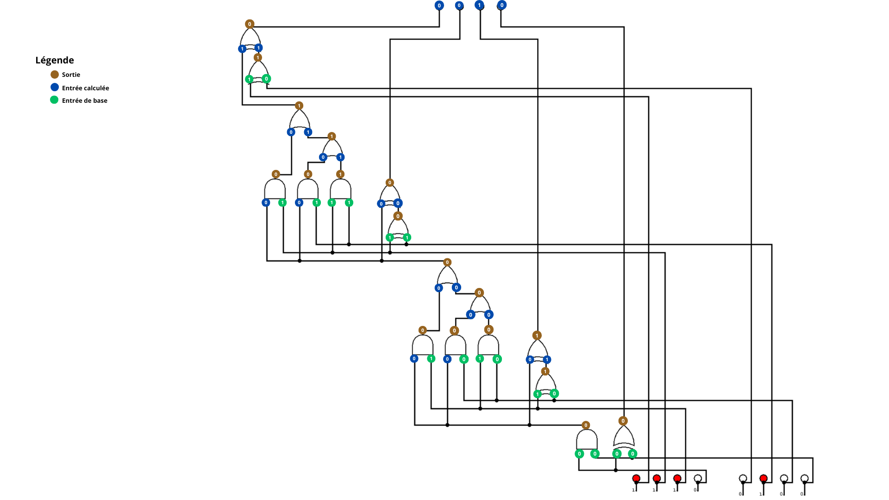

# =====================
#  Epreuve Badd Circuit
# =====================

Enoncé : Voilà un circuit logique qui implémente une fonction inconnue. Quelle est la valeur des 4 bits de sortie ?

Le flag à donner est au format FCSC{<valeur>}. En supposant que la valeur à trouver soit 0001, le flag serait FCSC{0001}.

Attention : Cette épreuve est limitée à trois essais.

```bash
    2 fichiers (pdf et png)
```

Solution : 


Résultat : FCSC{0010}